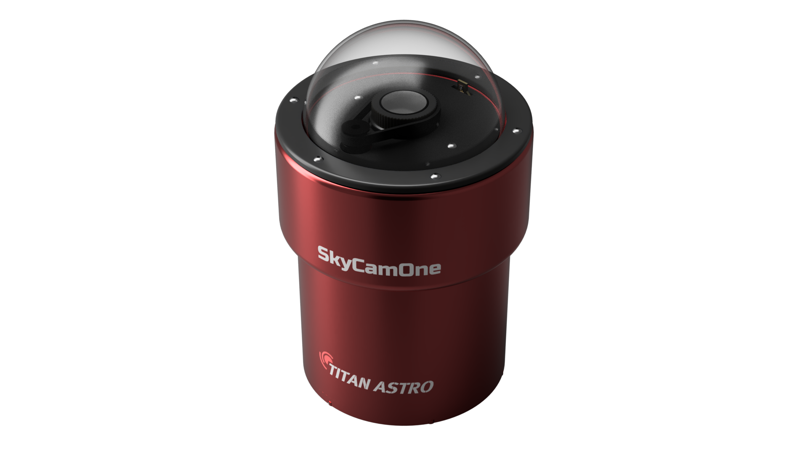

# How to build an allsky camera 

**A comprehensive guide**  

This is a living, breathing document. We will update this document regularly with new information and new insights.
If you wish to contribute, we applaud you and please feel free to do so. You could start by reading [CONTRIBUTING.md](CONTRIBUTING.md) to get oriented.

## Table of Contents

* **Start here**
    * [Introduction](docs/Introduction.md#introduction): Introduction to all sky cameras
    * [Requirements](docs/Introduction.md#requirements): What you want
    * [Shopping list](docs/Introduction.md#shoppinglist): What you need
* **Details of the build**
    * [Raspberry Pi](docs/components.md#raspberrypi): The heart of your all sky setup
    * [SkyCamOne HAT](docs/components.md#skycamone): The main electronic interface that makes your life easy
    * [Camera and Lens](docs/components.md#camera): The imaging device and optics
    * [Weatherproof Housing](docs/components.md#housing): The housing for your setup
    * [Dome](docs/components.md#dome): The window to the sky
    * [Power Supply](docs/components.md#powersupply) Juice, anyone?
    * [Dew Heater](docs/components.md#dewheater) Keeping moisture out
    * [Environment Sensor](docs/components.md#environmentsensor) 'Feeling' the air
    * [Stepper motor and belt/pulleys](docs/components.md#steppermotor) Moving your lens for focus
    * [Motor Mount](docs/components.md#motormount) Fix the motor somehow
    * [Servo Motor](docs/components.md#servomotor) Move something else
* **Sharing on the internet**
    * [Introduction](/docs/sharing_camera.md#introduction) Introduction to sharing your images
    * [Self-Hosted Solutions (Direct Exposure to the Internet)](/docs/sharing_camera.md#1-self-hosted-solutions-direct-exposure-to-the-internet)
    * [Best Practices for Mirroring and Secure Access](/docs/sharing_camera.md#2-best-practices-for-mirroring-and-secure-access)
    * [Common Challenges and How to Solve Them](/docs/sharing_camera.md#3-common-challenges-and-how-to-solve-them)
    * [Frequently Asked Questions (FAQ)](/docs/sharing_camera.md#frequently-asked-questions-faq)
* **Extra resources**   
  * [Titan Astro Github](https://github.com/TitanAstro)
    * [3D files](https://github.com/TitanAstro/3D-Resources)
    * [SkyCamOne HAT documentation](https://github.com/TitanAstro/SkyCamOneHAT-Documentation)
  * [Titan Astro on Facebook](https://www.facebook.com/titanastrocom/)
    * [Titan Astro Facebook Group](https://www.facebook.com/groups/titanastro)
  * [Allsky Camera Group](https://www.facebook.com/groups/172438633343696)

 
 

www.titanastro.com

